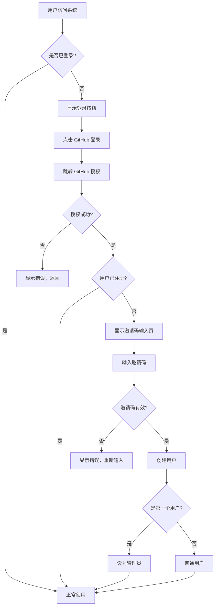

# 内容工厂 - 用户登录系统 PRD

> 版本：v1.0
> 日期：2024-12-13
> 状态：待评审

---

## 1. 背景与目标

### 1.1 背景

内容工厂是一个面向自媒体创作者的 AI 内容生产平台。当前系统存在以下问题：

- 无用户认证系统，任何人都可以访问所有数据
- API 配置（OpenAI、微信、小红书等）是全局共享的，无法支持多用户独立配置
- 左下角用户区域和右上角铃铛图标是占位符，没有实际功能

### 1.2 目标

实现用户登录系统，支持多用户独立使用，每个用户拥有自己的 API 配置和数据隔离。

### 1.3 成功指标

| 指标 | 目标值 |
|------|--------|
| 用户可以通过 GitHub 成功登录 | 100% 成功率 |
| 每个用户的 API 配置相互隔离 | 用户 A 看不到用户 B 的配置 |
| 未登录用户无法执行写操作 | 所有写操作需要登录 |
| 管理员可以生成和管理邀请码 | 功能可用 |

---

## 2. 现状问题

基于项目分析，当前存在以下问题：

| 问题 | 影响 | 严重程度 |
|------|------|----------|
| 无用户认证 | 数据安全风险，任何人可访问 | 高 |
| API 配置全局共享 | 无法支持多用户场景 | 高 |
| 左下角用户区域是假的 | 用户体验差，功能缺失 | 中 |
| 右上角铃铛无功能 | 占位符设计，用户困惑 | 低 |

---

## 3. 用户与使用场景

### 3.1 用户角色

| 角色 | 描述 | 权限 |
|------|------|------|
| 游客 | 未登录用户 | 只能浏览，不能操作 |
| 普通用户 | 已登录用户 | 管理自己的文章、配置 |
| 管理员 | 系统管理员 | 普通用户权限 + 管理邀请码 |

### 3.2 典型使用场景

**场景 1：新用户注册**

```
1. 用户 A 收到管理员分享的邀请码
2. 访问 content.hyxs.online，点击「GitHub 登录」
3. 跳转到 GitHub 授权页面，用户同意授权
4. 系统提示输入邀请码
5. 输入正确的邀请码后，注册成功
6. 跳转到设置页面，配置自己的 API
7. 开始使用系统
```

**场景 2：管理员邀请新用户**

```
1. 管理员登录系统
2. 访问 /admin 管理后台
3. 点击「生成邀请码」
4. 复制邀请码，通过微信/邮件发送给新用户
5. 可以查看邀请码使用状态（已使用/未使用）
```

**场景 3：未登录用户浏览**

```
1. 游客访问 content.hyxs.online
2. 可以看到仪表盘、选题分析等页面（数据为空或示例数据）
3. 点击「开始分析」等操作按钮时
4. 弹出提示「请先登录」，引导跳转登录页
```

---

## 4. 需求范围

### 4.1 MoSCoW 优先级

| 优先级 | 需求 |
|--------|------|
| **Must（必须）** | GitHub OAuth 登录 |
| **Must** | 邀请码注册机制 |
| **Must** | 用户数据隔离（文章、搜索记录、API配置） |
| **Must** | 管理员后台（生成/管理邀请码） |
| **Must** | 右上角用户头像下拉菜单 |
| **Must** | 未登录用户访问控制 |
| **Should（应该）** | 用户个人设置（修改昵称、头像） |
| **Should** | 左下角用户信息展示 |
| **Could（可选）** | 邀请码有效期设置 |
| **Could** | 用户列表管理（管理员查看所有用户） |
| **Won't（不做）** | 微信/Google 等其他登录方式（本期不做） |
| **Won't** | 用户权限细分（本期只有管理员/普通用户） |
| **Won't** | 消息通知系统（铃铛功能移除） |

---

## 5. 功能需求

### 5.1 GitHub OAuth 登录

**输入：**
- 用户点击「GitHub 登录」按钮

**处理：**
1. 跳转到 GitHub 授权页面
2. 用户同意授权后，GitHub 回调到 `/api/auth/callback/github`
3. 系统获取用户 GitHub 信息（id, login, name, email, avatar_url）
4. 检查用户是否已注册：
   - 已注册：直接登录，跳转首页
   - 未注册：跳转到邀请码输入页面

**输出：**
- 登录成功：设置 session，跳转首页
- 登录失败：显示错误信息

**异常处理：**
- GitHub 授权失败：显示「授权失败，请重试」
- 网络错误：显示「网络异常，请稍后重试」

### 5.2 邀请码注册

**输入：**
- GitHub 用户信息
- 用户输入的邀请码（第一个用户除外）

**处理：**
1. 检查系统是否已有用户
   - **如果是第一个用户**：跳过邀请码验证，直接注册并设为管理员
   - **如果不是第一个用户**：需要验证邀请码
2. 验证邀请码是否存在且未使用（非第一用户）
3. 创建用户记录，关联 GitHub 信息
4. 标记邀请码为已使用（非第一用户）
5. 设置 session，完成登录

**输出：**
- 第一个用户：直接注册成功，跳转首页，提示「欢迎！你是系统管理员」
- 后续用户注册成功：跳转首页或设置页
- 邀请码无效：显示「邀请码无效或已被使用」

**第一用户特殊流程：**
```
GitHub 授权成功 → 检测到系统无用户 → 显示欢迎页面
    → 「你是第一个用户，将自动成为管理员」
    → 点击「开始使用」→ 创建用户 → 进入系统
```

**数据结构：**

```typescript
// 邀请码
interface InviteCode {
  id: number;
  code: string;           // 邀请码（8位随机字符串）
  created_by: number;     // 创建者用户ID
  used_by: number | null; // 使用者用户ID
  used_at: string | null; // 使用时间
  created_at: string;
}
```

### 5.3 用户数据隔离

**影响的数据表：**

| 表名 | 改动 |
|------|------|
| `articles` | 新增 `user_id` 字段 |
| `search_records` | 新增 `user_id` 字段 |
| `source_articles` | 通过 `search_id` 间接关联用户 |
| `article_summaries` | 通过 `search_id` 间接关联用户 |
| `topic_insights` | 通过 `search_id` 间接关联用户 |
| `settings` | 改为 `user_id + key` 复合主键 |

**处理逻辑：**
- 所有查询自动加上 `WHERE user_id = 当前用户ID`
- 现有数据迁移：归属到第一个注册的用户

### 5.4 管理员后台

**页面路径：** `/admin`

**访问控制：**
- 仅管理员可访问
- 非管理员访问显示 403 或跳转首页

**功能列表：**

| 功能 | 描述 |
|------|------|
| 生成邀请码 | 点击按钮生成新的邀请码 |
| 邀请码列表 | 查看所有邀请码及状态 |
| 复制邀请码 | 一键复制到剪贴板 |
| 删除邀请码 | 删除未使用的邀请码 |

**界面设计：**
- 简洁的表格展示邀请码
- 状态标签：未使用（绿色）、已使用（灰色）
- 操作按钮：复制、删除

### 5.5 右上角用户头像下拉菜单

**替换原有铃铛图标**

**未登录状态：**
- 显示「登录」按钮

**已登录状态：**
- 显示用户头像（GitHub 头像或默认头像）
- 点击展开下拉菜单：
  - 用户昵称（不可点击，仅展示）
  - 「个人设置」→ 跳转 `/settings/profile`
  - 「管理后台」→ 跳转 `/admin`（仅管理员显示）
  - 分隔线
  - 「退出登录」→ 清除 session，刷新页面

### 5.6 左下角用户信息

**未登录状态：**
- 显示「登录」按钮

**已登录状态：**
- 显示用户头像
- 显示用户昵称
- 显示用户邮箱（如有）

### 5.7 未登录访问控制

**可浏览的页面：**
- 首页仪表盘（显示空状态或示例数据）
- 选题分析页面（可以看界面，不能搜索）
- 内容创作页面（可以看界面，不能生成）
- 文章列表页面（显示空状态）
- 设置页面（显示空状态）

**需要登录的操作：**
- 搜索关键词/公众号
- 生成文章
- 保存/编辑文章
- 发布文章
- 修改设置

**提示方式：**
- 点击操作按钮时，弹出 Toast 提示「请先登录」
- 同时显示「去登录」按钮，点击跳转登录页

### 5.8 个人设置页面

**页面路径：** `/settings/profile`

**功能：**
- 修改昵称
- 修改头像（上传或使用 GitHub 头像）
- 查看账号信息（GitHub 用户名、注册时间）

---

## 6. 非功能需求

### 6.1 性能

| 指标 | 要求 |
|------|------|
| 登录响应时间 | < 3秒（含 GitHub 跳转） |
| 页面加载时间 | < 2秒 |

### 6.2 安全

| 要求 | 说明 |
|------|------|
| Session 安全 | 使用 HttpOnly Cookie，设置合理过期时间 |
| CSRF 防护 | NextAuth.js 内置支持 |
| 邀请码安全 | 8位随机字符串，不可猜测 |

### 6.3 可用性

| 要求 | 说明 |
|------|------|
| 登录状态持久化 | 关闭浏览器后重新打开仍保持登录 |
| 错误提示友好 | 所有错误都有中文提示 |

---

## 7. 交互与流程

### 7.1 登录流程



### 7.2 页面结构变化

```
变更前：                          变更后：
┌─────────────────────────┐      ┌─────────────────────────┐
│ Header        [🔔]      │      │ Header        [👤 ▼]    │
├─────────────────────────┤      ├─────────────────────────┤
│        │                │      │        │                │
│ Sidebar│    Content     │      │ Sidebar│    Content     │
│        │                │      │        │                │
│        │                │      │        │                │
├────────┤                │      ├────────┤                │
│ [假用户]│                │      │ [真用户]│                │
└─────────────────────────┘      └─────────────────────────┘
```

---

## 8. 数据与字段

### 8.1 新增表：users

```sql
CREATE TABLE users (
  id INTEGER PRIMARY KEY AUTOINCREMENT,
  github_id TEXT UNIQUE NOT NULL,      -- GitHub 用户 ID
  github_login TEXT NOT NULL,          -- GitHub 用户名
  name TEXT,                           -- 显示昵称
  email TEXT,                          -- 邮箱
  avatar_url TEXT,                     -- 头像 URL
  role TEXT DEFAULT 'user',            -- 角色：admin / user
  created_at DATETIME DEFAULT CURRENT_TIMESTAMP,
  updated_at DATETIME DEFAULT CURRENT_TIMESTAMP
);
```

### 8.2 新增表：invite_codes

```sql
CREATE TABLE invite_codes (
  id INTEGER PRIMARY KEY AUTOINCREMENT,
  code TEXT UNIQUE NOT NULL,           -- 邀请码
  created_by INTEGER NOT NULL,         -- 创建者 ID
  used_by INTEGER,                     -- 使用者 ID
  used_at DATETIME,                    -- 使用时间
  created_at DATETIME DEFAULT CURRENT_TIMESTAMP,
  FOREIGN KEY (created_by) REFERENCES users(id),
  FOREIGN KEY (used_by) REFERENCES users(id)
);
```

### 8.3 修改现有表

```sql
-- articles 表新增 user_id
ALTER TABLE articles ADD COLUMN user_id INTEGER REFERENCES users(id);

-- search_records 表新增 user_id
ALTER TABLE search_records ADD COLUMN user_id INTEGER REFERENCES users(id);

-- settings 表改造（原来是 key 主键，改为 user_id + key）
-- 需要重建表
CREATE TABLE settings_new (
  user_id INTEGER NOT NULL,
  key TEXT NOT NULL,
  value TEXT NOT NULL,
  updated_at DATETIME DEFAULT CURRENT_TIMESTAMP,
  PRIMARY KEY (user_id, key),
  FOREIGN KEY (user_id) REFERENCES users(id)
);
```

---

## 9. 里程碑与排期

### MVP（最小可用版本）

| 任务 | 说明 |
|------|------|
| NextAuth.js 集成 | GitHub OAuth 配置 |
| 用户表创建 | users + invite_codes |
| 登录/注册流程 | 含邀请码验证 |
| 基础访问控制 | 未登录拦截写操作 |

### v1.0（完整版本）

| 任务 | 说明 |
|------|------|
| 数据隔离改造 | 现有表加 user_id |
| 数据迁移 | 现有数据归属第一用户 |
| 管理员后台 | /admin 页面 |
| UI 改造 | 头像下拉菜单、左下角用户信息 |
| 个人设置 | 修改昵称、头像 |

### v1.1（优化版本）

| 任务 | 说明 |
|------|------|
| 邀请码有效期 | 可设置过期时间 |
| 用户管理 | 管理员查看/禁用用户 |

---

## 10. 验收标准

| 编号 | 验收项 | 验收方法 |
|------|--------|----------|
| AC-1 | 新用户可以通过 GitHub + 邀请码注册 | 手动测试 |
| AC-2 | 已注册用户可以直接 GitHub 登录 | 手动测试 |
| AC-3 | 第一个注册用户自动成为管理员 | 检查数据库 role 字段 |
| AC-4 | 管理员可以生成邀请码 | 手动测试 |
| AC-5 | 用户只能看到自己的文章和配置 | 创建两个用户交叉验证 |
| AC-6 | 未登录用户点击操作按钮提示登录 | 手动测试 |
| AC-7 | 右上角显示用户头像和下拉菜单 | 视觉检查 |
| AC-8 | 退出登录后清除 session | 检查 Cookie |

---

## 11. 风险与对策

| 风险 | 可能性 | 影响 | 对策 |
|------|--------|------|------|
| GitHub API 不稳定 | 低 | 高 | 添加重试机制，友好错误提示 |
| 数据迁移出错 | 中 | 高 | 迁移前备份数据库，编写回滚脚本 |
| Session 过期体验差 | 中 | 中 | 设置合理过期时间，过期后友好提示 |

---

## 12. 未决问题（Open Questions）

| 编号 | 问题 | 状态 |
|------|------|------|
| OQ-1 | 邀请码是否需要设置有效期？ | 暂不需要，v1.1 考虑 |
| OQ-2 | 是否需要支持用户自己删除账号？ | 待讨论 |
| OQ-3 | 管理员是否可以转让？ | 待讨论 |

---

## 附录：技术选型

| 组件 | 选择 | 原因 |
|------|------|------|
| 认证库 | NextAuth.js (Auth.js) | Next.js 官方推荐，GitHub OAuth 开箱即用 |
| 数据库 | SQLite（保持不变） | 数据量小，无需更换 |
| Session 存储 | JWT + Cookie | 无需额外存储，适合当前规模 |
